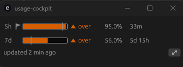
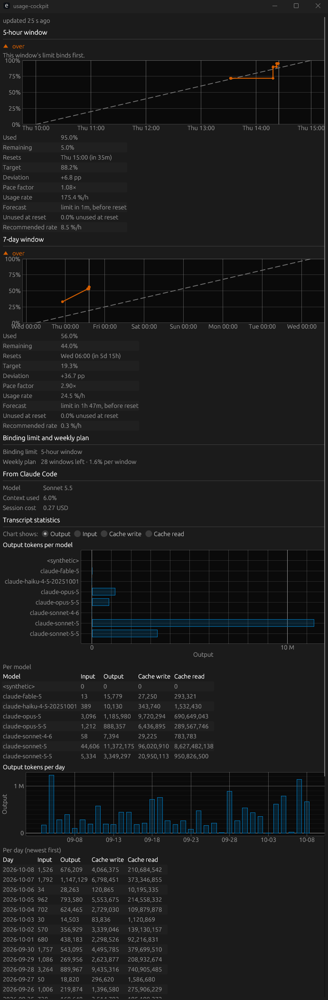

# Claude Code Token Usage Cockpit

A tiny, always-on-top cockpit that shows your Claude **5-hour** and **weekly** usage limits as live as possible and tells you at a glance whether you are using them faster or slower than an even pace. The goal: use your whole quota, but never run out before the reset.

> **Status: pre-release 0.1.0 (Windows x64), see the [release notes](docs/release-notes-0.1.0.md).** Live percentages only while Claude Code runs **in a terminal**; the VS Code extension apparently does not deliver them. Linux and macOS: compiled, never run. Read [what works when and why](docs/current-state.md) and the [critical look back](docs/retrospective.md) before you rely on it. The [user guide](docs/user-guide.md) explains how to start it, connect it to Claude Code and read the values.

## Screenshots

The compact view stays small and on top of other windows; the detailed view (key `D`) adds the charts, the forecast, the weekly plan and the token statistics per model and per day.

  

  

## Features

- Live view of the 5-hour window and the weekly limit: used, remaining, time to reset, with a chart of the current period.
- **Pace indicator:** actual usage compared with a linear target. Too slow means quota will expire unused, too fast means you will hit the limit before the reset.
- Forecast of when 100 % would be reached at the current pace, the projected unused remainder, the pace that would use the quota exactly by the reset, the binding limit and a weekly plan.
- Updates itself without user action and always shows how old the displayed data is.
- A compact always-on-top window and a detailed view; token statistics per model and per day from the local transcript files.
- One executable per platform, no installer. Targets: Windows x64, macOS Apple Silicon, Linux x64, Linux arm64 (Raspberry Pi).

## Start

1. Get the program: download the file for your system from the *Releases* page once a release exists, or build it with a current stable Rust toolchain: `cargo build --release` (the program is `target/release/usage-cockpit`, with `.exe` on Windows).
2. Put it in any folder and start it. The window shows *No data yet*.
3. Press **Set up bridge** in the window and confirm. After the next response of Claude Code **in a terminal** (`claude`) the values appear; the VS Code extension apparently does not deliver them (see [docs/current-state.md](docs/current-state.md)).

Details, troubleshooting and how to remove everything again: [docs/user-guide.md](docs/user-guide.md).

## Where the data comes from

Claude Code passes the usage percentages and reset times of both windows to a configurable [status line command](https://code.claude.com/docs/en/statusline). The cockpit reads this documented interface locally. It does not consume any tokens. Known limits of this source: it works only for Claude.ai Pro/Max subscriptions, only while Claude Code runs, and it reports percentages, not absolute token counts. Details and alternatives: [docs/research/data-sources.md](docs/research/data-sources.md).

## Documentation

| Document | Content |
|---|---|
| [docs/retrospective.md](docs/retrospective.md) | A critical look back at the autonomous project: what went wrong, why, and what has to change in future projects |
| [docs/current-state.md](docs/current-state.md) | Where the program stands today: data sources, what works when, concept problems, how to use it anyway |
| [docs/user-guide.md](docs/user-guide.md) | The manual: install the portable program, set it up, use it, read every value, remove everything again |
| [docs/development-guide.md](docs/development-guide.md) | How to set up the tools, build, test and change the program by hand, without AI help |
| [docs/technical-documentation.md](docs/technical-documentation.md) | How the program works, as built: data flow, modules, files, bridge, calculations, window, setup and removal, build and test |
| [docs/project-brief.md](docs/project-brief.md) | The original project brief |
| [docs/project-description.md](docs/project-description.md) | Goals, metrics, data sources, risks |
| [docs/requirements.md](docs/requirements.md) | Requirements with IDs (draft) |
| [docs/traceability.md](docs/traceability.md) | Requirement → issue → PR → test |
| [docs/measurements.md](docs/measurements.md) | How speed and resource use are measured, with results |
| [docs/decisions/](docs/decisions/) | Architecture decision records |
| [CONTRIBUTING.md](CONTRIBUTING.md) | How work is organised in this repository |

## AI-assisted development

This project is developed with the help of an AI coding agent (Claude Code), under the direction and responsibility of the maintainer. Commits made with agent assistance carry a `Co-Authored-By` trailer, and issues and pull requests created by the agent carry the `agent` label.

## Disclaimer

This is an unofficial project. It is not affiliated with, endorsed by, or sponsored by Anthropic. "Claude" and "Claude Code" are trademarks of Anthropic, used here only to describe compatibility.

## License

[Apache License 2.0](LICENSE). Copyright and trademark notes: [NOTICE](NOTICE). The licences of the components built into the program: [THIRD_PARTY_LICENSES.md](THIRD_PARTY_LICENSES.md) (made with `scripts/third-party-licenses.ps1` or `.sh`; `cargo deny check licenses` accepts only the licences listed in `deny.toml`).
