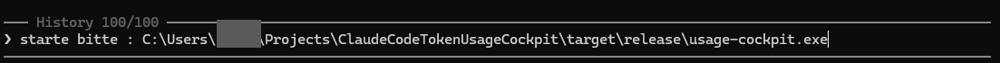

# Current state, concept problems and how to use it anyway

Status of 2026-10-08. This page says plainly what the program does today, what it cannot do, and how to get the most out of it until the concept is changed (issue #175).

## 1. In one paragraph

The program (`usage-cockpit`) is a small window that shows how much of the 5-hour and the 7-day limit of Claude Code has been used, with pace, forecast and charts. **It is not a live monitor of the account.** It shows live values only while a Claude Code **terminal** session is answering (the VS Code extension apparently does not feed it); at any other time it shows the last values it received, marked *stale*, plus token counts that it adds up from the files Claude Code writes on the same computer. This is a consequence of the chosen data source, not a defect of single functions.

## 2. Where the data comes from

| Source | What it gives | When |
|---|---|---|
| **A. Status line** of Claude Code (documented) | the 5-hour and 7-day percentages and reset times | only when Claude Code runs as the **terminal client** and has just answered |
| **B. Transcript files** of Claude Code on this computer (format undocumented) | token counts per message, model and day | any time, this computer only, last 35 days |
| **C. Server-side usage source** (undocumented, reported by community projects) | the same percentages without a running session | never used; requirement REQ-019 is blocked by an open owner decision |

How source A works: Claude Code starts the program as a short command (the *bridge*, `usage-cockpit bridge`) at every status line update, hands it the data on standard input, and the bridge stores one record in the data folder. The window reads that folder. The bridge works whether or not the window runs.

## 3. What works in which situation

| Situation | 5-hour row | 7-day row |
|---|---|---|
| You chat in Claude Code in a **terminal** | live percentage, pace, forecast, chart | the same |
| You chat only in the **VS Code extension** | no new percentage (observed: the extension does not call the status line); once the last percentage has expired the row shows *N tokens in 5 h* from source B | the last percentage, grey, *stale*; *N tokens in 7 d* once it has expired |
| Windows has just started, nobody chats | as above: stale values or the token count | as above |
| Another computer of yours is used | **not visible** (source B and the bridge cover this computer only) | not visible |
| Computer without any Claude Code | nothing, except old records | nothing |

The percentages are the only values that tell how near the limit is. Token counts (source B) are not a percentage; the size of the limit is not published.

## 4. Concept problems

1. **Not live without a terminal session.** The percentages exist only inside a running terminal Claude Code at the moment of an answer. The program cannot ask for them. An autostart of the window therefore shows no live values after the system start; it shows the last ones, stale.
2. **The VS Code extension apparently does not feed it.** Observed on one computer: all recent sessions ran in the extension and no record arrived after the last terminal session. The official description of the status line is for the terminal client. Whoever works only in the extension gets no percentages.
3. **Not autonomous.** The program needs a Claude Code installation with the bridge set up on every computer that is to be watched. It cannot watch other computers by itself.
4. **No official server-side interface for a Pro account.** The organisation interfaces (usage and cost, Claude Code analytics, enterprise analytics, team export) exist for organisations, not for a Pro subscription. According to the terms of use as read by the research agent (not re-checked by hand, no legal advice), using the login of a subscription in a third-party program is not permitted. Source C is undocumented and its terms position is unclear. So a Pro account has no official way to read the window percentages without a local Claude Code.
5. **Requirements that forbid the alternatives.** REQ-104 (never store, log or display credentials) and REQ-103 (no network traffic except a possible REQ-019) were written for the status line design. A login based source would need an owner decision on both.
6. **The limit was documented only in part.** The README and the research page state that data arrives only while Claude Code runs and only for Pro and Max. They did not state that the VS Code extension is not served, and the project description listed source C as an open decision of the owner, without spelling out what that means for daily use.

## 5. Requirements

All requirements are in [requirements.md](requirements.md); the link from requirement to issue, pull request and test is in [traceability.md](traceability.md).

| Group | Requirements | State |
|---|---|---|
| Display of the windows and calculations | REQ-001 to REQ-008, REQ-021, REQ-022, REQ-027 | approved, built, tested with sample data; **they need the percentages (source A)** |
| Data age, refresh, no-data state, sessions | REQ-009, REQ-010, REQ-016, REQ-017 | approved, built |
| Data sources | REQ-011 (status line), REQ-014 and REQ-015 (token statistics, estimate) | approved, built; REQ-019 (server-side source) **blocked, owner decision open** |
| Bridge and its setup | REQ-012, REQ-020, REQ-023, REQ-109 | approved, built; tests with sample data in the repo; a hand test with the real terminal client is reported by the author and not recorded in the repo (section 7) |
| History, settings, logging, windows, charts | REQ-013, REQ-018, REQ-024 to REQ-026, REQ-028 to REQ-033 | approved, built |
| Technical and quality requirements | REQ-101 to REQ-116 | approved; most built; releases in CI (REQ-111) wait for the CI workflow files, which need the owner's go-ahead (issue #23) |
| Portable use, remove everything | REQ-117, REQ-119 | **draft** (the owner sets *approved*), built on Windows |
| Start with the system | REQ-118 | **rejected** (owner decision 2026-10-08), switch removed; *Remove everything* still removes an old entry |
| Token use without status line data | REQ-120 | **draft**, built (text in the row only, no chart) |

Only the owner changes an approved requirement. The concept problems above concern REQ-011, REQ-017, REQ-019, REQ-103 and REQ-104.

## 6. How to use it anyway

1. Start `usage-cockpit.exe` (portable; any folder). In the window press *Set up bridge* and confirm. This is the only change to your Claude Code settings; *Remove bridge* undoes it.
2. Open **Claude Code in a terminal** (in VS Code: *Terminal*, *New Terminal*, then `claude`) and send a message. After its answer the rows show the percentages and the charts fill.

   

3. Keep working in the terminal if you want live values. In the extension alone the percentages stand still.
4. The detailed view (key `D`) shows token statistics per day and per model with charts, from the local files; they work at any time.

Details: [user-guide.md](user-guide.md).

## 7. What is verified and what is not

| Statement | Basis |
|---|---|
| The bridge records percentages with the real Claude Code terminal client, values equal to `/usage` | hand test of the author on Windows, 2026-10-07 (versions 2.1.288 and 2.1.293); **not recorded in the repo**, to be repeated and written down |
| A non-interactive run (`claude -p`) does not call the status line | one hand run on 2026-10-08; **not recorded in the repo** |
| The VS Code extension does not call the status line | observed on one computer; the official description is for the terminal; not tested in a controlled way |
| No official interface returns the window percentages for a Pro account | read from the official documentation by a research agent (list in issue #175); not re-checked by hand |
| Linux and macOS | compiled and linted from Windows only; never run |
| Several computers together | not tried; not supported by the design |

## 8. Open decisions (owner)

- Which data source the program shall use instead of, or beside, the terminal-only status line (issue #175): own counting from the local files as the main display (works any time, tokens instead of percentages), a shared folder that several computers write and one computer reads, or source C (undocumented, terms unclear).
- Whether REQ-104 and REQ-103 may change for such a source.
- Whether REQ-117 to REQ-120 become *approved*.
