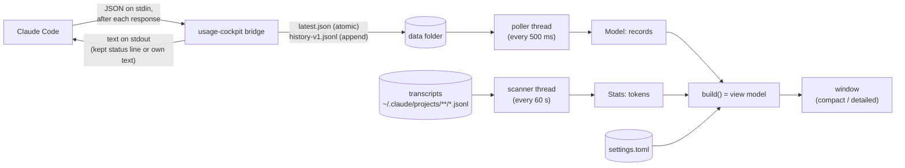

# Technical documentation

How the program works, as built. This document describes what the code does today; [concept.md](concept.md) is the design document it grew from, [requirements.md](requirements.md) says what the program must do, and the [user guide](user-guide.md) says how to use it. Where this document and the code disagree, the code is right and this document is wrong: please fix it.

**What was tried.** Everything below was checked against the code and tried on Windows. Statements about Linux and macOS follow the code (which compiles for them in principle) but were **not tried**, and each says so where it matters.

## Contents

1. [Overview and data flow](#1-overview-and-data-flow)
2. [Repository and modules](#2-repository-and-modules)
3. [Files and formats](#3-files-and-formats)
4. [The bridge](#4-the-bridge)
5. [The calculations](#5-the-calculations)
6. [The window](#6-the-window)
7. [Setting itself up and removing itself](#7-setting-itself-up-and-removing-itself)
8. [Build, test and release](#8-build-test-and-release)
9. [Security and privacy](#9-security-and-privacy)
10. [Limits and known weaknesses](#10-limits-and-known-weaknesses)
11. [Where to start when changing something](#11-where-to-start-when-changing-something)

## 1. Overview and data flow

One executable, `usage-cockpit`, has three roles, chosen by its command line:

- **the window** (no arguments): shows the usage of the 5-hour window and the 7-day window;
- **the bridge** (`usage-cockpit bridge`): started by Claude Code as its *status line command*; it receives one JSON record on standard input, stores it and prints a short text;
- **setup commands** (`setup-bridge`, `remove-bridge`, `uninstall`, and a hidden `finish-uninstall`): change the Claude Code settings and clean up.

There are two sources of numbers. The **status line record** carries the usage percentages and reset times (the only source for the limits). The **transcript files** of Claude Code carry absolute token counts (used for statistics and the estimate, never for the limits).



The bridge and the window never talk to each other directly: the data folder is the only interface. The window may be closed, restarted or not running at all while Claude Code keeps feeding the bridge; the history in the data folder bridges the gaps.

The program makes no network connection of its own. See [section 9](#9-security-and-privacy).

## 2. Repository and modules

A Cargo workspace with two crates:

- `crates/core` (library `cockpit-core`): everything that can be tested without a window or an operating system call. Pure functions, file formats, calculations, the view model.
- `crates/app` (binary `usage-cockpit`): the command line, the bridge, the window, and everything that touches the system (processes, registry, console).

### 2.1 `cockpit-core`

| Module | Purpose |
|---|---|
| `model` | `Record` (one stored status line record), `WindowSample` (used %, reset time), `WindowKind` (`FiveHour`, `SevenDay`). |
| `parse` | Turns the status line JSON into a `Record`. Reads a generic JSON value, so missing or unexpected fields never fail the parse; only the fields the program uses are taken, the rest is dropped without being stored or logged. |
| `paths` | The per-user data folder, configuration folder and the Claude Code folder. The environment is passed in (`*_with`) so tests need no global state. `USAGE_COCKPIT_HOME` overrides data and configuration (`<home>/data`, `<home>/config`); `CLAUDE_CONFIG_DIR` overrides the Claude Code folder. |
| `store` | The data folder: `latest.json`, `last_error.json`, `history-v1.jsonl`, the history lock, atomic writes, pruning, removal of leftover temporary files. |
| `periods` | Groups records into *periods* (one run of a window from one reset to the next). A calculation never mixes periods. |
| `metrics` | The pure calculations of section 5. They get the time as a parameter and never read a clock. |
| `planning` | The weekly plan: the weekly quota spread over the 5-hour windows that are left. |
| `transcripts` | Parsing of transcript lines, de-duplication, aggregation per model and per day, and the incremental `Scanner`. |
| `settings` | `settings.toml`: loading never fails (defaults for a missing or broken file), saving, the allowed ranges. |
| `format` | Every displayed text of a number, time or state (decimals, thousands separators, the minus sign `−`, `×`, `–` for no value). |
| `viewmodel` | `build(&Inputs) -> ViewModel`: every string, number and state the window draws, with all decisions. No GUI type appears here. |
| `logging` | A small rotating file logger. |

### 2.2 `usage-cockpit` (crate `app`)

| Module | Purpose |
|---|---|
| `main` | Chooses the role from the command line; opens the window; runs the bridge. |
| `cli` | The command line with `clap`. |
| `console` | On Windows the program is built for the GUI subsystem (no black window on double click); commands that print for a person attach to the console of the program that started them. The bridge never does: Claude Code reads its output through a pipe. |
| `bridge` | Bridge mode (section 4). |
| `shell` | Runs the *kept* status line command through the shell Claude Code would use, with a timeout. |
| `setup` | Sets the bridge up and removes it in the Claude Code settings (section 7). |
| `quoting` | Quoting of the bridge command for `sh -c` and reading it back; no dependencies, compiled everywhere. |
| `commands` | The command line side of setup, removal and uninstall: asking, printing, exit codes. |
| `autostart` | The start entry of the system (section 7.3). |
| `uninstall` | *Remove everything* (section 7.4). |
| `instance` | One window per user: an exclusive lock on `cockpit.lock`. |
| `gui` | The window: `mod.rs` (the application object), `state.rs` (data and threads), `compact.rs`, `detailed.rs`, `chart.rs` (history chart), `bars.rs` (token bar charts), `theme.rs` (colours and symbols), `settings_view.rs`, `bridge_view.rs`, `uninstall_view.rs` (dialogs), `window_state.rs` (position, size, level). |

`main.rs` has a test that pins a rule: **the bridge starts without running any GUI code**. The test checks that `bridge.rs` and `shell.rs` mention no GUI code; in the program, only `main` starts the window.

## 3. Files and formats

### 3.1 Where

| | Windows | macOS | Linux |
|---|---|---|---|
| Data | `%LOCALAPPDATA%\usage-cockpit\data` | `~/Library/Application Support/usage-cockpit` | `$XDG_DATA_HOME/usage-cockpit` (default `~/.local/share/usage-cockpit`) |
| Configuration | `%APPDATA%\usage-cockpit\config` | same as data | `$XDG_CONFIG_HOME/usage-cockpit` |
| Claude Code | `%USERPROFILE%\.claude` | `~/.claude` | `~/.claude` |

(The folders come from the `directories` crate. The macOS and Linux columns follow the crate's documentation and were not tried.) `USAGE_COCKPIT_HOME` and `CLAUDE_CONFIG_DIR` override them; the tests use both and never touch real folders.

### 3.2 The data folder

| File | Content | Written by | Notes |
|---|---|---|---|
| `latest.json` | `{"v":1,"record":{...}}`, the newest record | the bridge | replaced atomically |
| `last_error.json` | `{"v":1,"received_at_ms":...,"kind":"malformed"}` | the bridge | when an input could not be used |
| `history-v1.jsonl` | one JSON object per line, `{"v":1, ...record fields}` | the bridge | appended under `history.lock` |
| `history.lock` | empty | bridge and window | exclusive lock while appending or pruning |
| `cockpit.lock` | empty | the window | held while a window runs |
| `log.txt`, `log.1.txt`, `log.lock` | text log | both | rotation at 5 MB under `log.lock` |
| `uninstall-pending` | empty | the window | marker for the deletion helper (section 7.4) |

The record's JSON fields: `received_at_ms`, `session_id`, `cc_version`, `five_hour` and `seven_day` (each `{"used_pct":..,"resets_at":..}` or absent), `model`, `context_used_pct`, `cost_usd`.

**Format versions.** Every file carries `"v"`. Readers accept the versions they know and skip lines of an unknown version. The history file name carries the version too (`history-v1`).

**Atomic replacement.** `write_atomic` writes a uniquely named temporary file (`<name>.<pid>.<nanos>.<counter>.tmp`) and renames it over the target. On Windows a rename can fail briefly with *permission denied* while a reader has the target open: it is retried up to 5 times with 20 ms pauses. The window removes temporary files older than one minute at start.

**Appending.** Before appending a line, the writer checks the last byte of the file and writes a newline first if it is not one (a bridge killed by Claude Code can leave a partial last line). Readers need no lock and skip every line that does not parse.

**Retention.** The history keeps 35 days and at most 50 MiB (pruned down to 45 MiB). Pruning runs in the window at start and then hourly, under the history lock (waits at most 5 s).

### 3.3 The configuration folder

- `settings.toml`: `version`, `tolerance_pp` (0 to 50, default 5), `stale_after_s` (60 to 86,400, default 600), `rate_period_s` (300 to 7,200, default 1,800), `always_on_top` (default true), `start_view` (`compact` or `detailed`) and a `[window]` table (`x`, `y`, `width`, `height`). A missing file gives the defaults; a file that is not valid TOML is renamed to `settings.toml.invalid` and the defaults are used; a single value that is missing, of the wrong type or out of range falls back to its default while the others are kept.
- `bridge-state.json`: `{"v":1,"previous_status_line": <object or null>}`, the status line that was replaced by the bridge. It is written only by setup and removal (the commands, and the window's dialogs for them, which call the same functions), never by the window's own saving of settings and geometry, so a running window cannot overwrite it by accident.

### 3.4 Files of Claude Code that the program touches

- `<claude dir>/settings.json`: `statusLine` is set and restored (section 7). Other keys keep their values and order (`serde_json` with `preserve_order`). A backup `settings.json.usage-cockpit-backup-<YYYYMMDD-HHMMSS>` is made before every change; two backups in one second do not overwrite each other.
- `<claude dir>/projects/**/*.jsonl`: the transcripts, **read only**.

## 4. The bridge

`bridge::run` in this order:

1. Read standard input, at most 1 MiB. Larger input counts as unusable.
2. Parse. On success: log one line if `cc_version` changed from the previous record, write `latest.json`, append one history line (waits at most 200 ms for the lock, then skips the line and logs). On failure: write `last_error.json` and log one line **without** the input. Every failure here is only logged.
3. If `bridge-state.json` holds a usable previous status line (an object of type `command` with a non-blank command), run it with the original input on its standard input and a **1 second timeout**. If it exits with 0 in time and prints something other than whitespace, its output is printed unchanged.
4. Otherwise print the bridge's own text: `5h 23.5% · 7d 41.2%` (a window that was not delivered shows `–`, values above 100 show as 100), or `usage-cockpit: no data` if the input was unusable.
5. Exit with **0 in every case**. A panic inside the bridge is caught; the no-data text is printed and the exit code is still 0.

The record is stored **before** the kept command runs, so a slow or failing kept command never costs data.

**Speed.** Almost all of the time is the start of the process. On the development machine the median of 100 calls is about 66 ms, the same as the program started with `--version` (see [measurements.md](measurements.md)). The bridge initialises no GUI code and writes no console.

**The kept command (`shell`).** Unix: `sh -c <command>`. Windows: Git for Windows bash, searched in this order: `CLAUDE_CODE_GIT_BASH_PATH`, `%ProgramFiles%\Git\bin\bash.exe`, `%ProgramFiles(x86)%\Git\bin\bash.exe`, `%LOCALAPPDATA%\Programs\Git\bin\bash.exe`, and `..\bin\bash.exe` or `..\..\bin\bash.exe` next to a `git.exe` found on the `PATH` (for `Git\cmd` and `Git\mingw64\bin`); a `bash.exe` below `System32` is never used (that is WSL). If none is found, `powershell -NoProfile -Command`. The standard library has no wait with timeout, so the child is polled every 10 ms; input and output are served from threads (a command that does not read its input cannot block); on timeout the child is killed. On Windows the child is put in a **job object** with kill-on-close, so a grandchild such as a `sleep` started by bash dies too; otherwise it would keep the output pipe open and Claude Code would wait for the end of the output. Output is cut at 1 MiB.

## 5. The calculations

All in `cockpit-core::metrics`, `periods` and `planning`; the view model only calls them. Notation for one window: `u` used percent (clamped to 0 to 100), `R` reset time, `L` length of the window (5 h = 18,000 s; 7 d = 604,800 s), `now`, `tol` the tolerance band, `P` the rate period.

**Periods.** Records of one window kind are grouped in received order. A record continues the current period if its reset time differs from the period's last reset time by at most 600 s **and** it was received before that reset time; otherwise it starts a new period. The *current* period is the latest one whose reset time is in the future; it is the base of the usage rate and the chart. A window shows *Window reset. Waiting for new data from Claude Code.* when the reset time of the **newest record** (by receive time) has passed.

**Basic values.**
- remaining = 100 − u; time to reset = max(0, R − now);
- elapsed share e = clamp((now − (R − L)) / L, 0, 1); **target** t = 100·e;
- **deviation** d = u − t (percentage points); **pace factor** f = u / t (not available while t = 0);
- **state**: d < −tol is *under*, d > tol is *over*, otherwise *on pace*.

*Example:* e = 0.5, u = 30 gives d = −20, *under*; u = 52 gives *on pace*; u = 70 gives *over*. u = 60 at e = 0.4 gives +20 pp and f = 1.5.

**Usage rate.** The samples of the current period received within the last P seconds; with at least two at different times, the least-squares slope of used percent over time, in percent per hour; a negative slope counts as 0; otherwise not available. *Example:* (10:00, 40), (10:15, 45), (10:30, 50) gives 20 %/h.

**Forecast.** Checked in this order: u ≥ 100 is *limit reached*; no rate is *not available*; rate 0 is *reset first*; otherwise T100 = now + (100 − u) / rate · 3600 s, and *limit first* if T100 < R, else *reset first* (reaching 100 % exactly at the reset counts as reset first). *Example:* u = 40, rate 20 gives 3 h.

**Unused at reset.** max(0, 100 − (u + rate · hours left)); *example:* 40 + 5·4 = 60, so 40 % stay unused. **Recommended rate:** (100 − u) / hours left, while the reset is in the future.

**Binding limit.** Of the two windows, the one that is exhausted first: *limit reached* counts as exhausted now, *limit first* at its predicted time, the others never. If both are exhausted at the same moment, the 7-day window binds (it holds you back longer). If neither reaches its limit before its reset, or a window has no data, there is none.

**Weekly plan.** Only when both windows have data (the 5-hour window too) and the reset of the 7-day sample of the newest record is in the future: n = ⌈(R7 − now) / 18,000 s⌉ in integer arithmetic and (100 − u7) / n percent per 5-hour window. *Example:* 50 h left and 60 % remaining give n = 10 and 6 %.

**Data age and stale.** Age = now − received time of the newest record (0 for a record from the future). *Stale* if the age exceeds `stale_after_s`, **or** if `last_error.json` is newer than the newest record (a malformed record arrived). The values stay, marked stale.

**Tokens per percentage point (estimate).** For the current 5-hour period: the tokens (input + output + cache write + cache read) of the transcripts from the receive time of the period's first record until now, divided by the rise of the used percentage from the first to the last sample of the period. Only if the rise is at least 1 pp and there were tokens; always shown as an *estimate*.

**Transcript statistics.** A line counts if it has `"type":"assistant"`, a valid RFC 3339 `timestamp` and a `message.usage` object; a missing count is 0, a missing model is `unknown`. Entries are de-duplicated by (`message.id`, `requestId`), the last occurrence wins (a resumed session can repeat messages). Totals per model and per **local** calendar day. *Cache share* = (cache write + cache read) ÷ (input + cache write + cache read). The `Scanner` remembers per file the byte offset of the last complete line and the modification time, reads only new lines, re-reads a file that became shorter, forgets files that no longer exist, and looks only at files modified within the last 35 days. It keeps the entries of all those files **in memory** (see section 10). If no line could be understood anywhere, the window says *transcript statistics not available*.

## 6. The window

**Start.** `main` starts the log, takes the single-instance lock (`cockpit.lock`; a second start only shows a small notice and ends), reads the settings, and calls `gui::run`, which opens an `eframe` window (egui 0.33, `glow` backend) at the saved position and size, on top if the settings say so.

**Threads.** Plain `std` threads, no async runtime; they send over channels and wake the window with `request_repaint`:
- the **poller** reads `latest.json` and `last_error.json` every 500 ms and compares by content (a changed file time is not needed); a file that cannot be parsed at that moment (it is being replaced) counts as unchanged; a newer `last_error.json` is reported as its own event (it makes the data *stale*);
- the **scanner** scans the transcripts at once and then every 60 s and sends the totals;
- the **pruner** prunes the history at once and then hourly.

The window loads the history once at start. A record that is both in the history and in `latest.json` is not taken in twice (the newest five are compared).

**State and view model.** `AppState` holds the records, the last error time, the newest statistics and the settings. At the start of each frame the channels are drained. `view_model(now)` calls `build()` and caches the result by (second, data version), so the model is rebuilt at most once per second or when data or settings change. The window repaints every second so that countdowns move.

**Views.** The *compact* view (about 320 × 120) has one row per window (label, binding flag, bar with the target mark, state symbol and word, used share, countdown) and a bottom line; the *detailed* view (about 520 × 640, scrolling) has both windows with all values, binding limit and weekly plan, session details, transcript statistics with the bar charts of `bars.rs` and the tables, previous periods, the history charts of `chart.rs`, and a footer with the buttons. The key `D` (without modifiers, not while a text field has the keyboard, not while a dialog is open) switches views. Both views **only lay out** what the view model provides.

**Colour is never the only carrier.** Every state has a symbol and a word; the colours are from the Okabe-Ito palette. The default egui fonts lack the characters ▼ ● ▲ ⚑ ⏸ ○ ⤢, so these symbols are drawn as shapes (`theme.rs`).

**Dialogs** are windows inside the window: settings, bridge setup or removal, *Remove everything*. While a dialog is open the views behind it do not react. The compact view is too small for them, so opening a dialog switches to the detailed view first.

**Position and size.** Saved to `settings.toml` one second after the last change and on exit; restored at start with the stored values checked for sense: a position that is not a finite number or beyond ±16,000 is dropped (the system then chooses), and the size is held between 100 × 60 and 8,000 × 8,000. The position is **not** checked against the connected monitors (see section 10). The level (*always on top*) follows the setting live.

## 7. Setting itself up and removing itself

The program is **portable**: it installs nothing, so until the person asks, it changes nothing outside its own file and its two folders. Four things can be set up, each with its own undo.

### 7.1 The bridge entry (`setup`)

`setup` takes every path and the consent as arguments (`confirm: &mut dyn FnMut(&str) -> bool`), so the command line and the window use the same code and tests need no global state.

1. Build the command from the path of the running executable with forward slashes: `<path> bridge`. For a path with a space: on Windows the **8.3 short name of the folder** is used (the file name stays, because the removal recognises the bridge by the name `usage-cockpit[.exe]`), or, if the volume has no short names, the whole path in double quotes (Git Bash and cmd accept that, PowerShell does not). On Linux and macOS the path is quoted for `sh -c` whenever `sh` would read it differently (space, quote, dollar sign and so on; a plain path stays as it is): single quotes, with a single quote inside written as `'\''` (`quoting.rs`, a file without dependencies on the rest of the program that is compiled and tested on every system). This was checked against a real POSIX shell (Git for Windows bash) with a folder name containing a space, an apostrophe and a dollar sign; it was **not tried on Linux or macOS**.
2. Read the settings (a missing file is fine, a file that is not a JSON object is an error and nothing is changed). If `statusLine` already is exactly this command, report *already set up*.
3. Give the planned change as text to `confirm`. A *no* leaves the file byte-identical.
4. Make the backup (if the file exists), keep a replaced status line in `bridge-state.json` (an old bridge entry from another folder does not count as "previous"), set `statusLine` to `{"type":"command","command":"<path> bridge"}` and write the file atomically.

`remove` is the reverse: if the current `statusLine` is the bridge (`is_bridge`: type `command`, a command of the form `<path> bridge`, the path read the way a shell reads the first word (`quoting::first_word`: plain, in double quotes, or in single quotes), whose program is named `usage-cockpit` or `usage-cockpit.exe`), it asks, makes a backup, puts the stored status line back (or removes the key if there was none) and clears the stored value. A corrupt `bridge-state.json` makes it refuse (it holds the person's old status line).

The window cannot wait inside a callback. `bridge_view` therefore calls `setup` **twice**: first with a callback that only keeps the plan text and says no; after the person's *yes* a second time with a callback that accepts only the same plan. If the settings changed in between, the plan differs and nothing is changed.

On Windows the command line cannot ask a question reliably (after attaching to the parent console the program shares its input), so `setup-bridge`, `remove-bridge` and `uninstall` require `--yes` there.

### 7.2 One window at a time

`instance::acquire` takes an exclusive lock on `cockpit.lock`; a failure to create or lock the file is logged and the window starts without protection (a window that cannot start is worse than two windows).

### 7.3 The start entry (`autostart`)

**Windows:** one value `UsageCockpit` below `HKEY_CURRENT_USER\Software\Microsoft\Windows\CurrentVersion\Run`, holding the quoted path of the executable; no administrator rights. The *real* state is read, not remembered: *off*, *on*, *stale* (the entry starts another file, because the program was moved), or *switched off in the Windows list of startup apps* (Windows keeps that in `...\Explorer\StartupApproved\Run`; a first byte with the lowest bit set means off). Switching on or off also removes the cockpit's own mark in `StartupApproved\Run` so that a switched-off entry can be switched on again. The setting is offered in the settings dialog, acts at once, and is **never** switched on by itself. With `USAGE_COCKPIT_HOME` set, the value is called `UsageCockpitTestHome`, so a test never touches a real entry. Linux and macOS have no such switch yet; the module reports *unsupported* there.

### 7.4 Remove everything (`uninstall`)

`describe` returns the plan in words and changes nothing; `run` does the steps in this order: the bridge entry (as `remove`), the start entry, and, only if the person chose it, the data and configuration folders. The folders are cleaned **file by file**: only files with the known names (and the temporary files `<known name>.<n>.<n>.<n>.tmp` of atomic writes) are deleted, and a folder only if it is empty afterwards (a link as the folder is refused), so a wrongly set `USAGE_COCKPIT_HOME` cannot cost other files. If a step failed, the data is kept: the stored status line is needed to put the old one back. The backups of the Claude Code settings and the program file always stay.

The running window holds files in the data folder open. So the window does not delete them itself: it writes the marker `uninstall-pending` into the data folder, starts **itself again** as the hidden command `finish-uninstall --after <pid>` (detached, without a window), and exits when the person presses OK. The helper deletes **only if** the marker exists, the window's process has ended (on Windows it waits at most five minutes and deletes nothing if the process is still alive after that; on other systems it only pauses three seconds, because that part is not done for them yet), and the bridge is really gone from the Claude Code settings. It retries locked files for about ten seconds. It has no window and cannot report problems (the user guide says to delete a folder by hand if one is still there). The command line `uninstall --remove-data` deletes at once after checking that no window runs (it takes the instance lock and releases it before deleting); if a window runs, it still removes the bridge entry and the start entry, keeps the data, and says so.

## 8. Build, test and release

**Build.** `cargo build --release` gives `target/release/usage-cockpit[.exe]`. The toolchain is pinned in `rust-toolchain.toml` (1.99.0, with `rustfmt` and `clippy`); the declared minimum is Rust 1.89 (`rust-version`), needed for `File::try_lock`. `crates/app/build.rs` embeds the short git commit as `GIT_COMMIT` (shown by `--version` and in the footer; `unknown` without git). `.cargo/config.toml` links the C runtime statically for `x86_64-pc-windows-msvc`, so the Windows executable needs no Visual C++ runtime; the DLLs it still imports all ship with Windows (list in [measurements.md](measurements.md)). A `RUSTFLAGS` environment variable overrides that setting.

**Checks before every change** (`cargo` from the toolchain):

```
cargo fmt --all --check
cargo clippy --all-targets -- -D warnings
cargo test --all
```

**Tests.** Unit tests live next to the code; integration tests are in `crates/core/tests/` (calculations, parser, store, view model, transcripts, robustness with damaged input) and `crates/app/tests/` (the real executable: bridge, command line, setup, uninstall, a chain from the bridge to a kept command, and a scan of the window's source that checks that the user guide names every label and button; in `crates/core/tests/` also `user_guide.rs`, which checks that every message of the view model is explained in the guide). **Test names contain the requirement id** (`req_023_...`), which is how [traceability.md](traceability.md) is maintained. Tests never touch real folders: they set `USAGE_COCKPIT_HOME` and `CLAUDE_CONFIG_DIR` to temporary folders, and tests that need the Windows registry use a value name of their own and remove it afterwards.

**Measuring.** `scripts/measure-bridge.ps1`, `measure-startup.ps1` and `measure-idle.ps1` measure the bridge speed (REQ-109), the time to the first frame (REQ-116) and the load of the idle window (REQ-105); [measurements.md](measurements.md) holds the method and results. Scripts for Linux and macOS do not exist yet.

**CI and releases.** The only workflow today (`.github/workflows/ci.yml`, Linux) checks that the required project files exist and that requirement ids are unique; it does **not** build or test the code yet. Builds and tests on the four targets (Windows x64, macOS Apple Silicon, Linux x64, Linux arm64) and the release workflow are planned and need the owner's go-ahead because they change workflow files. No release exists yet.

## 9. Security and privacy

- **No network connection of its own.** There is no network code of the program's own, and `cargo tree` shows no HTTP or TLS crate among the dependencies. On Linux the accessibility part of the window toolkit pulls in D-Bus and async I/O crates (`zbus`, `async-io`); they talk to local services only. On Windows and macOS `cargo tree` shows no async-runtime crate. A look at a running Windows window with the system tools, in an earlier session, showed no TCP or UDP endpoint (not repeated for every build). The program uses no tokens and does not log in anywhere.
- **It starts the web browser in one place:** the link *Licence notices* in the footer of the detailed view opens the system browser when the person clicks it; the program itself makes no connection.
- **What is read:** the status line record on the bridge's standard input; its own folders; the Claude Code `settings.json` (only to set or restore `statusLine`); the transcript files (read only, only the token counts, timestamps, model names and message ids are used).
- **What is written:** its own data and configuration folders; `statusLine` in the Claude Code `settings.json` (always with a backup, never without consent); one registry value for the start entry, only on request.
- **What is never stored or logged:** other fields of the status line input, the content of messages, environment variables, the content of the Claude Code settings. A malformed input is logged as one line without its content.
- **Consent.** Every change to the Claude Code settings shows what will change first and needs a yes (or `--yes`). Every deletion of data needs an explicit choice.
- **Paths.** Deletion works by exact file names; links are not followed.

## 10. Limits and known weaknesses

- **Data only while Claude Code runs.** The limits exist only after the first response of a session, only for Claude.ai Pro and Max subscriptions, and only for usage on this computer.
- **The transcript format is undocumented.** Parsing is tolerant, but a change by Claude Code can make the statistics empty or wrong (the window then says *not available*, it does not crash).
- **Memory.** The scanner keeps the entries of all transcript files of the last 35 days in memory: an average of 88 MB of resident memory over ten minutes with 811 MB of transcripts in total (the files of the last 35 days count) on the development machine, measured before the C runtime was linked in (see [measurements.md](measurements.md)), against a limit of 100 MB (REQ-105); a machine with more transcript text needs more.
- **Bridge speed** is dominated by the start of the process; the 100 ms limit is met on the development machine (66 ms) but depends on the machine and security software.
- **A `statusLine` in a project's own Claude Code settings** overrides the bridge in that project.
- **The window position is not checked against the monitors**: after unplugging a monitor the window may open outside the visible area.
- **Quoting in PowerShell.** The quoted bridge command (used only when a volume has no 8.3 names) does not run if Claude Code uses PowerShell as the shell for the status line.
- **Not tried:** Linux and macOS (build, window, setup, autostart, uninstall), a Windows without development tools, the light theme, scaling other than 100 %, several monitors.
- **Licence notices:** the footer links to `THIRD_PARTY_LICENSES.md`, which does not exist yet (part of the legal files before a release).
- **A model `<synthetic>`** with zero tokens appears in the per-model table; it comes from the transcripts and is harmless.

## 11. Where to start when changing something

| I want to … | Look at |
|---|---|
| change a displayed text or number format | `cockpit-core::format`, then `viewmodel` (the texts are tested there) |
| add a value to the window | compute it in `metrics` (pure, with a test), expose it in `viewmodel`, draw it in `gui/detailed.rs` or `compact.rs`; tests with `req_` names; explain it in the user guide |
| change a threshold or an allowed range | `cockpit-core::settings` (ranges), `metrics`/`periods` (constants), `gui/settings_view.rs` (dialog) |
| read a new field of the status line | `parse`, `model` (and the `v` of the files if the format changes), then `store` |
| change what the bridge prints | `bridge::status_text` and the bridge tests; keep the exit code 0 and the speed |
| change the transcript statistics | `transcripts` (parse, aggregate, `Scanner`), then `viewmodel::transcripts` |
| add a chart | `gui/bars.rs` or `gui/chart.rs`; the numbers come from the view model |
| add a command | `cli`, `main`, `commands`; on Windows decide about `--yes` and the console |
| support a new system | `paths`, `shell` (the shell), `autostart`, `setup` (path quoting), `uninstall` (`wait_for_exit`), and the open issues of that system |

When you add behaviour, add the requirement (`docs/requirements.md`, status `draft` until the owner approves), a test whose name contains its id, an entry in `docs/traceability.md`, and the user guide.
